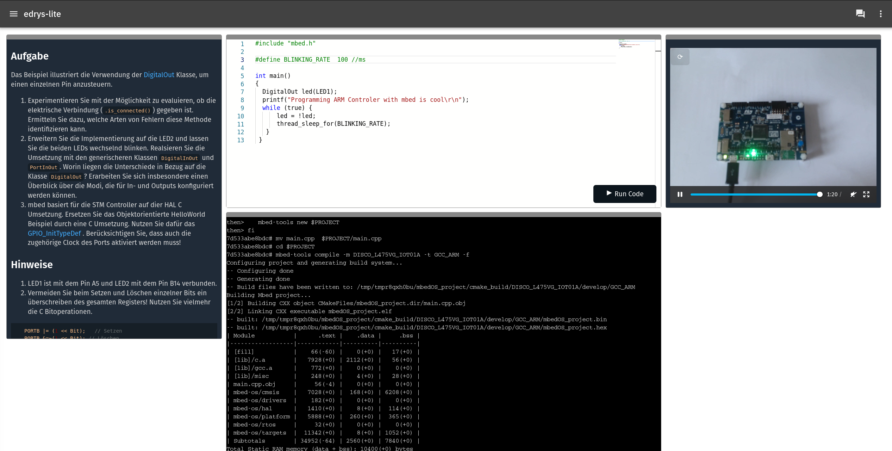

# lab-stm-programming-mbed

HelloWorld Lab in C and C++ (STM HAL, mbed) ...



In order to run this lab, you will need to run docker and the following command on the computer that is running in station mode.
This will install the pyxtermjs server and the necessary tools to program the STM32 board.

``` bash
docker run -it --privileged \
    --name edrys_arm_development \
    -p 5000:5000 \
    -e PYXTERM_CMD=zsh \
    --device /dev/ttyACM0 \
    -v /media/crosslab/DIS_L4IOT:/media/appuser/DIS_L4IOT \
    -v /dev/disk/by-id:/dev/disk/by-id \
    -v /dev/serial/by-id:/dev/serial/by-id \
    -v /run/udev:/run/udev:ro \
    crosslab/edrys_pyxtermjs_stm:latest
```

As an alterniative, you can also run the terminal server manually from your machine by using Python.
For more information on this, please visit:

https://github.com/edrys-labs/module-pyxtermjs

## Lab Configuration

There are two ways to deploy this lab, using the `Deploy` button:

[](https://edrys-labs.github.io/?/deploy/https://raw.githubusercontent.com/edrys-labs/lab-stm-programming-mbed/main/laboratory/base.yaml)

Or, if you already have created a new classroom for [edrys-Lite](https://edrys-labs.github.io), you can add this lab to your classroom by importing the following URL:

https://raw.githubusercontent.com/edrys-labs/lab-stm-programming-mbed/main/laboratory/base.yaml

## Demo

https://github.com/edrys-labs/lab-stm-programming-mbed/assets/3089101/59ef0e89-dbab-4d64-a1d8-933c34f841a6
