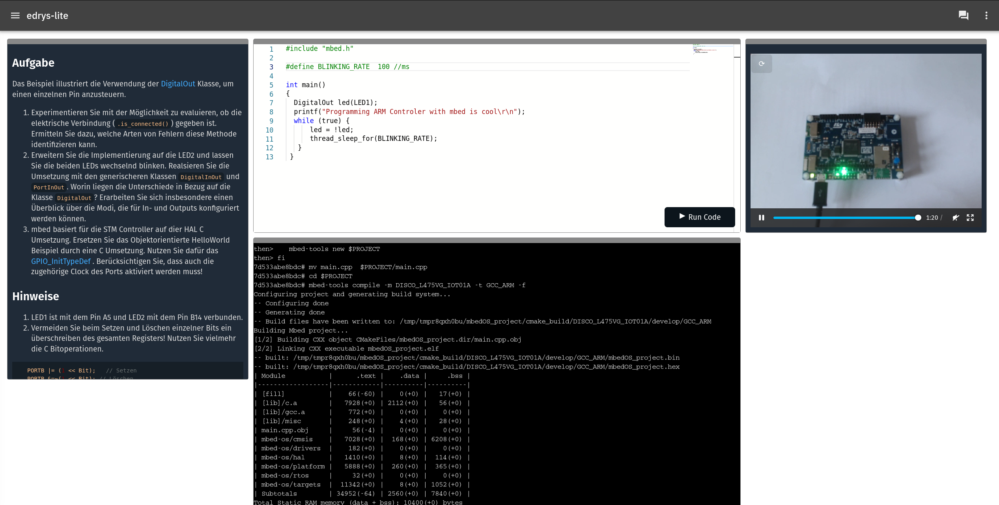

# lab-stm-programming-mbed

HelloWorld Lab in C and C++ (STM HAL, mbed)




``` bash
docker run -it --privileged \
    --name edrys_arm_development \
    -p 5000:5000 \
    -e PYXTERM_CMD=zsh \
    --device /dev/ttyACM0 \
    -v /media/crosslab/DIS_L4IOT:/media/appuser/DIS_L4IOT \
    -v /dev/disk/by-id:/dev/disk/by-id \
    -v /dev/serial/by-id:/dev/serial/by-id \
    -v /run/udev:/run/udev:ro \
    crosslab/edrys_pyxtermjs_stm:latest
```

## Lab Configuration

## Demo


https://github.com/edrys-labs/lab-stm-programming-mbed/assets/3089101/59ef0e89-dbab-4d64-a1d8-933c34f841a6

